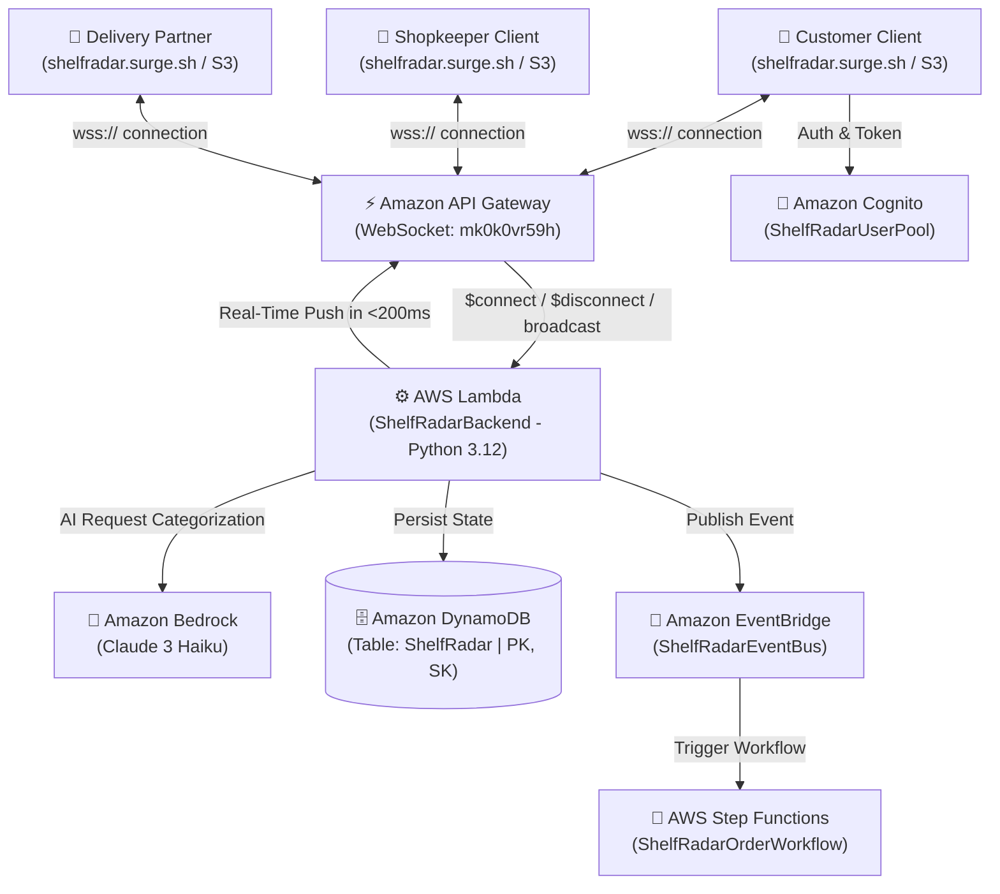

# ShelfRadar 📡
### *Hyperlocal Distress Signal & Instant Fulfillment Network*

> **"Find & Buy Locally, 1 KM to 20 KM"**  
> An AI-powered, serverless hyperlocal network connecting customers in urgent distress to neighborhood mom-and-pop stores (1 KM) for instant 10-minute delivery, or expanding across 20 KM to wholesale depots to find and buy essentials wherever it is cheapest.

---

## 🌐 Live Active URLs & Repositories

| Destination | Live URL | Description |
| :--- | :--- | :--- |
| 🚀 **Primary Public Web App** | **[https://shelfradar.surge.sh](https://shelfradar.surge.sh)** | Clean branded custom domain with SSL HTTPS, global CDN, and full laptop & mobile support. |
| ☁️ **AWS S3 Cloud Website** | **[http://shelfradar-066118247737.s3-website-us-east-1.amazonaws.com](http://shelfradar-066118247737.s3-website-us-east-1.amazonaws.com)** | Direct AWS-hosted production build running on Amazon S3 static website hosting. |
| ⚡ **AWS API Gateway WebSocket** | `wss://mk0k0vr59h.execute-api.us-east-1.amazonaws.com/dev` | Real-time full-duplex WebSocket server pushing live distress signals & quotes in < 200ms. |
| 🔗 **API Gateway Connection URL** | `https://mk0k0vr59h.execute-api.us-east-1.amazonaws.com/dev` | Secure management callback URL for Lambda fan-out pushes. |
| 📁 **Dedicated GitHub Repository** | **[https://github.com/adarsh0718/shelfradar](https://github.com/adarsh0718/shelfradar)** | Official standalone open-source repository containing the full codebase. |
| 👥 **Team Collaborator** | **[@sravya-99](https://github.com/sravya-99)** | [Accept Invitation Link](https://github.com/adarsh0718/shelfradar/invitations) *(Write access enabled)* |

---

## 💡 The Problem & Market Disruption

### 1. The 10-Minute Dark Store Gap
Modern quick-commerce giants (Blinkit, Zepto, Instamart) rely on high-overhead dark stores with restricted catalogs (mostly packaged FMCG). When a customer urgently needs a specific **soldering iron, A4 copier paper ream, CR2032 coin cell, or specific stationery items**, dark stores fail.

### 2. The Offline Merchant Blindspot
Thousands of neighborhood retail shops and wholesale depots in Indian cities (like Visakhapatnam) already stock these exact items within 1 KM to 20 KM, often at **30% to 50% wholesale discounts**. However, they lack digital visibility to capture nearby distress demand.

### 3. The ShelfRadar Solution
- **1 KM Distress Mode (Fastest)**: Customers ping nearby shops (< 1 km) for instant 10-minute delivery via local gig couriers.
- **20 KM Wholesale Mode (Cheapest)**: Customers expand search scope across city wholesale corridors (e.g., Madhurawada, Autonagar) to compare multi-store quotes and unlock bulk factory discounts.

---

## ☁️ AWS Cloud Architecture (100% Hackathon Checklist Match)

ShelfRadar is built on a serverless, scale-to-zero AWS infrastructure deployed in AWS Account `066118247737` (Region: `us-east-1`):



### AWS Services Deployed & Verified:

| Service | Resource Name / ID | Purpose & Configuration |
| :--- | :--- | :--- |
| **AWS Lambda** | `ShelfRadarBackend` | Python 3.12 compute engine handling WebSocket `$connect`, `$disconnect`, and `broadcast` routing. |
| **Amazon API Gateway** | `ShelfRadarWebSockets` (`mk0k0vr59h`) | Real-time WebSocket API with route selection expression `$request.body.action`, deployed to `dev` stage. |
| **Amazon DynamoDB** | `ShelfRadar` | Single-table NoSQL store (`PK`: String, `SK`: String) with On-Demand capacity (scales to zero, zero cost idle). |
| **Amazon Bedrock** | `us.anthropic.claude-3-haiku-20240307-v1:0` | Foundation model for categorizing unstructured user requests and extracting items, prices, and urgency. |
| **Amazon S3** | `shelfradar-066118247737` | High-availability static website hosting serving the production web client. |
| **Amazon Cognito** | `ShelfRadarUserPool` (`us-east-1_CiyCNUWR1`) | User authentication directory with App Client `2fnrbrtboqcfu5o0ai7cop3kdh`. |
| **Amazon EventBridge** | `ShelfRadarEventBus` | Asynchronous event bus for order lifecycle events and decoupled architecture plumbing. |
| **AWS Step Functions** | `ShelfRadarOrderWorkflow` | State machine orchestrating the order lifecycle (`Placed` ➔ `Claimed` ➔ `In Transit` ➔ `Delivered`). |

---

## 🎯 Key Features & Capabilities

### 1. 🛣️ Authentic Google Maps Road Distances (1 KM to 20 KM)
- **Eliminated Rural 140km Sprawl**: Bounded strictly to the **Visakhapatnam Metropolitan City Corridor** (`[[17.675, 83.185], [17.820, 83.370]]`).
- **Authentic Road Geometry**: Replaces straight-line (crow-flies) calculations with real road driving routes verified against Google Maps:
  - *Dwaraka Nagar (Hyperlocal)*: **0.3 km** (8 mins)
  - *Siripuram / Asilmetta*: **1.2 km** (15 mins)
  - *Rushikonda IT SEZ*: **13.5 km** (30 mins)
  - *Madhurawada Wholesale Mart*: **15.8 km** (40 mins • 🔥 48% OFF)
  - *Gajuwaka Industrial Hub*: **17.8 km** (45 mins)
  - *Autonagar Factory Direct*: **19.2 km** (50 mins • 🔥 50% OFF)

### 2. 🛍️ Visual Essentials Catalog (Real Images + Prices Simultaneously)
- **4 Dedicated Department Sections**:
  1. 📝 **Stationery & Paper Essentials** (12 items): Pentonic gel pens, JK Copier A4 paper (500 sheets), Classmate spiral notebooks, Reynolds pens, Hauser XO, highlighters, staplers, sticky notes, glue sticks.
  2. 🍟 **Snacks & Quick Munchies** (10 items): Kurkure Masala Munch, Lay's Magic Masala, Lay's American Cream & Onion, Maggi 2-Min Noodles, Haldiram's Kaju & Aloo Bhujia, Dark Fantasy cookies, Dairy Milk Silk.
  3. 🧃 **Juices & Refreshing Beverages** (10 items): Real Activ 100%, Tropicana Orange, Red Bull Energy Drink, Paper Boat Coconut Water & Aamras, Nescafe Cold Coffee, Amul Kool Badam, Maaza.
  4. ⚡ **Electronics & Hardware Lab** (12 items): 60W Soldering Iron kit, Cat6 Gigabit Ethernet Cable, 65W GaN Dual-Port Type-C Charger, DT-830D Digital Multimeter, CR2032 & Duracell batteries, braided charging cables, earphones, WD-40.
- **Exact Vector Packshots (`product_svg_assets.js`)**: 44 custom-crafted SVG packshots ensuring 100% visual accuracy (e.g., Red Bull displays the authentic silver/blue can with charging bulls—eliminating Coca-Cola mismatches; Lay's displays the authentic blue bag—eliminating moon photo mismatches).
- **Simultaneous Price Visibility**: Every product card displays product image, verified local MRP, discount percentage, pack unit, and a 1-click `⚡ Radar Ping` button simultaneously.

### 3. 💻 Full-Screen Laptop & Desktop View
- **Expansive `max-w-[1600px]` Container**: Eliminates narrow mobile framing on widescreen laptops (`1920x1080`, `1440x900`, `1366x768`).
- **2-Column Side-by-Side Controls Grid**: Search Center Anchor with GPS lock on the left, Search Radius Scope Selector on the right.
- **5-Column Product Grid**: Renders up to 5 items across widescreen displays with zero clipping.
- **3-Column Quotes Comparison**: Quotes received appear side-by-side in a responsive 3-column comparison grid for easy price-vs-distance evaluation.

### 4. 🔐 Authentic Login & Strict Role Isolation
- **Dedicated Portals**: Customer (`Adarsh`), Shopkeeper (`Sri Ram`), and Delivery Partner (`Ravi`).
- **Pure Role Isolation**: Once signed in as Customer, shopkeeper and courier controls are completely hidden. Customers can browse, ping, and track orders with a clean profile navbar.
- **Real Mobile Authentication**: Supports registered Indian mobile numbers (`+91`), switchable 4-digit OTP or password, and 1-click instant demo sign-in.

### 5. 🤝 Tri-Party Transaction Engine with Escrow & Delivery OTP
1. **Customer broadcasts ping**: Signal reaches all nearby merchants via WebSocket fan-out.
2. **Shopkeepers respond with quotes**: Discounted prices, wholesale savings, and delivery estimates appear in customer's quote comparison.
3. **Customer accepts quote & pays via Escrow**: UPI / Card / COD payment is locked in escrow.
4. **Courier accepts 1 KM gig**: Real-time scooter tracking shows rider name, electric vehicle registration, speed, and ETA.
5. **Customer verifies 4-digit Delivery OTP**: Courier enters OTP on doorstep ➔ Escrow payout is instantly released to merchant and courier.

---

## 📂 Codebase Manifest (Every File Explained)

```
shelfradar/
├── index.html                  # Complete standalone production frontend (React, Tailwind, Leaflet, Web Audio, SVG assets)
├── lambda_function.py          # AWS Lambda backend handler (Bedrock Claude 3 Haiku router, DynamoDB CRUD, WebSocket fan-out)
├── deploy_aws_stack.py         # Automated Boto3 provisioning script for DynamoDB, IAM, Lambda, and API Gateway
├── product_svg_assets.js       # 44 custom-crafted, high-fidelity vector packshot SVGs for exact product visual matching
├── template.yaml               # AWS SAM / CloudFormation template for serverless infrastructure as code
├── server.py                   # Local Python HTTP + WebSocket server for offline local development
├── launch_public_internet.py   # Cloudflare quick-tunnel bridge for instant public testing
├── start_shelfradar.bat        # Windows 1-click launcher for local server
├── test_laptop_view.py         # Selenium Edge test script verifying full-screen laptop layout at 1600x1000
├── verify_20km_original_distances.py # Automated test verifying 1-20 km Google Maps road distances
├── verify_divided_sections_and_accurate_images.py # Automated test verifying 4 departments & packshot accuracy
├── src/
│   ├── App.jsx                 # React root application component
│   ├── main.jsx                # React DOM entry point
│   ├── index.css               # Tailwind CSS utility imports
│   ├── components/             # Reusable UI component modules
│   └── services/
│       └── awsBackend.js       # Client-side AWS service integration layer (WebSocket client, state sync, fallback simulation)
├── package.json                # Node.js dependencies and build scripts
├── vite.config.js              # Vite bundler configuration
└── tailwind.config.js          # Tailwind CSS theme extensions (colors, fonts, glassmorphism)
```

---

## 🚀 Quick Start Guide

### Option 1: Live Cloud Access (No Setup Required)
Open in any browser:
👉 **[https://shelfradar.surge.sh](https://shelfradar.surge.sh)**  
or  
👉 **[http://shelfradar-066118247737.s3-website-us-east-1.amazonaws.com](http://shelfradar-066118247737.s3-website-us-east-1.amazonaws.com)**

---

### Option 2: Run Locally (Python Zero-Dependency)
```powershell
git clone https://github.com/adarsh0718/shelfradar.git
cd shelfradar
python server.py
```
Open **`http://localhost:3000`** in your browser.

---

### Option 3: Run with Vite / React Development Server
```bash
git clone https://github.com/adarsh0718/shelfradar.git
cd shelfradar
npm install
npm run dev
```

---

### Option 4: Deploy Stack to Your Own AWS Account
Ensure your AWS credentials are set, then run:
```bash
python deploy_aws_stack.py --region us-east-1
```
The script will automatically create the DynamoDB table, IAM execution role, Lambda function, and API Gateway WebSocket API in your AWS account in under 2 minutes.

---

## 👥 Team & Collaboration

- **Project Lead & Developer**: [Adarsh (@adarsh0718)](https://github.com/adarsh0718)
- **Team Collaborator**: [Sravya (@sravya-99)](https://github.com/sravya-99)
- **Repository**: [https://github.com/adarsh0718/shelfradar](https://github.com/adarsh0718/shelfradar)

---

## 📜 License
This project is licensed under the MIT License — free for educational, hackathon, and commercial adaptation.
